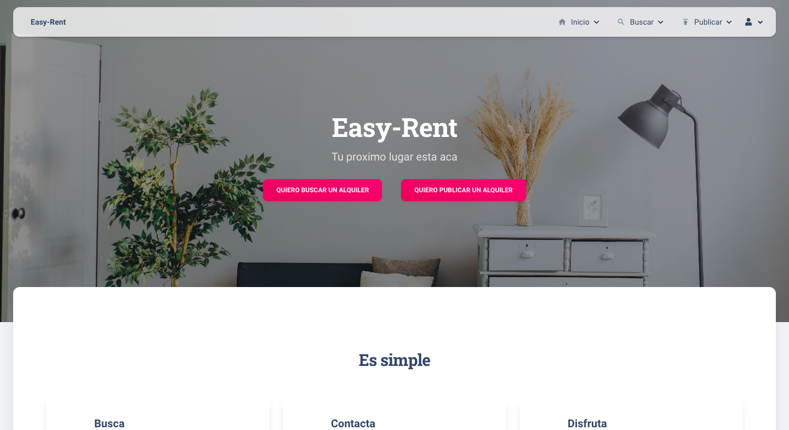

<a name="readme-top"></a>
[![Contributors][contributors-shield]][contributors-url]
[![Forks][forks-shield]][forks-url]
[![Stargazers][stars-shield]][stars-url]
[![Issues][issues-shield]][issues-url]
[![MIT License][license-shield]][license-url]
[![LinkedIn][linkedin-shield]][linkedin-url]

<!-- PROJECT LOGO -->
<br />
<div align="center">
  <a href="https://github.com/guille1093/SpringWebApp-POO2">
    
  </a>

<h3 align="center">Object Oriented Programming 2</h3>

  <p align="center">
    A WebApp project.
  </p>
</div>

<!-- TABLE OF CONTENTS -->
<details>
  <summary>Table of Contents</summary>
  <ol>
    <li>
      <a href="#about-the-project">About The Project</a>
      <ul>
        <li><a href="#built-with">Built With</a></li>
      </ul>
    </li>
    <li>
      <a href="#getting-started">Getting Started</a>
      <ul>
        <li><a href="#prerequisites">Prerequisites</a></li>
        <li><a href="#installation">Installation</a></li>
      </ul>
    </li>
    <li><a href="#usage">Usage</a></li>
    <li><a href="#roadmap">Roadmap</a></li>
    <li><a href="#contributing">Contributing</a></li>
    <li><a href="#license">License</a></li>
    <li><a href="#contact">Contact</a></li>
    <li><a href="#acknowledgments">Acknowledgments</a></li>
  </ol>
</details>

<!-- ABOUT THE PROJECT -->

## About The Project

<div align="center">

<a href="https://github.com/guille1093/SpringWebApp-POO2">

</a>
</div>

### Built With

- ![Java][java]
- ![Thymeleaf][thymeleaf]
- ![Spring][spring.io]
- ![Maven][maven]
- ![PostgreSQL][postgresql]
- [![Bootstrap][bootstrap.com]][bootstrap-url]
- ![Sass][sass]

<p align="right">(<a href="#readme-top">back to top</a>)</p>

<!-- GETTING STARTED -->

## Getting Started

To get a local copy up and running follow these simple steps.

### Prerequisites

1. Check if you have Java installed
   ```sh
   java -version
   ```
2. If you don't have Java installed, install it from [here][java-url] or run the following command:
   ```sh
   sudo apt install default-jre
   ```
   ```sh
   sudo apt install default-jdk
   ```

### Installation

1. Get a coffee 😉 .
2. Clone the repo ⬇️
   ```sh
   git clone https://github.com/guille1093/SpringWebApp-POO2.git
   ```
3. Configure the database in the `application.properties` file
   ```sh
    spring.datasource.url=jdbc:postgresql://localhost:5432/your_database
    spring.datasource.username=your_username
    spring.datasource.password=your_password
   ```
4. Install Maven packages
   ```sh
    mvn install
   ```
5. Run the project
   ```sh
    mvn spring-boot:run
   ```
6. Open the browser and go to `localhost:8080`
7. Enjoy!

<p align="right">(<a href="#readme-top">back to top</a>)</p>

<!-- USAGE EXAMPLES -->

## Usage

_For more information about the usage of the software please refer to the [Documentation](https://example.com)_

<p align="right">(<a href="#readme-top">back to top</a>)</p>

<!-- ROADMAP -->

## Roadmap

- [x] JSP Migration
- [ ] SpringSecurity
- [x] Ligth Mode UI
- [x] Material Desing

See the [open issues](https://github.com/guille1093/SpringWebApp-POO2/issues) for a full list of proposed features (and known issues).

<p align="right">(<a href="#readme-top">back to top</a>)</p>

<!-- CONTRIBUTING -->

## Contributing

Contributions are what make the open source community such an amazing place to learn, inspire, and create. Any contributions you make are **greatly appreciated**.

If you have a suggestion that would make this better, please fork the repo and create a pull request. You can also simply open an issue with the tag "enhancement".
Don't forget to give the project a star! Thanks again!

1. Fork the Project
2. Create your Feature Branch (`git checkout -b feature/AmazingFeature`)
3. Commit your Changes (`git commit -m 'Add some AmazingFeature'`)
4. Push to the Branch (`git push origin feature/AmazingFeature`)
5. Open a Pull Request

<p align="right">(<a href="#readme-top">back to top</a>)</p>

<!-- LICENSE -->

## License

Distributed under the GPL-3.0 License. See `LICENSE.txt` for more information.

<p align="right">(<a href="#readme-top">back to top</a>)</p>

<!-- CONTACT -->

## Contact

Quintana Guillermo: guillermo.quintana@fceqyn.unam.edu.ar

Cristaldo Yonathan Ariel: cristaldoyonathanariel@gmail.com

Stigelmeier Marcela: stigelmarce@gmail.com

Kachuk Marcelo: marcelonkachuk@gmail.com

Fernandez Matias: fernandezmati@gmail.com

Blazco Emiliano: emilianoblazco@gmail.com

Project Link: [https://github.com/guille1093/SpringWebApp-POO2](https://github.com/guille1093/SpringWebApp-POO2)

<p align="right">(<a href="#readme-top">back to top</a>)</p>

<!-- ACKNOWLEDGMENTS -->

## Acknowledgments

- []() To the National University of Misiones.
- []() Lic. Claudio Biale for the support.
- []() To all the contributors and members of the development team.

<p align="right">(<a href="#readme-top">back to top</a>)</p>

<!-- MARKDOWN LINKS & IMAGES -->
<!-- https://www.markdownguide.org/basic-syntax/#reference-style-links -->

[contributors-shield]: https://img.shields.io/github/contributors/guille1093/SpringWebApp-POO2.svg?style=for-the-badge
[contributors-url]: https://github.com/guille1093/SpringWebApp-POO2/graphs/contributors
[forks-shield]: https://img.shields.io/github/forks/guille1093/SpringWebApp-POO2.svg?style=for-the-badge
[forks-url]: https://github.com/guille1093/SpringWebApp-POO2/network/members
[stars-shield]: https://img.shields.io/github/stars/guille1093/SpringWebApp-POO2.svg?style=for-the-badge
[stars-url]: https://github.com/guille1093/SpringWebApp-POO2/stargazers
[issues-shield]: https://img.shields.io/github/issues/guille1093/SpringWebApp-POO2.svg?style=for-the-badge
[issues-url]: https://github.com/guille1093/SpringWebApp-POO2/issues
[license-shield]: https://img.shields.io/github/license/guille1093/SpringWebApp-POO2.svg?style=for-the-badge
[license-url]: https://github.com/guille1093/SpringWebApp-POO2/blob/master/LICENSE.txt
[linkedin-shield]: https://img.shields.io/badge/-LinkedIn-black.svg?style=for-the-badge&logo=linkedin&colorB=555
[linkedin-url]: https://linkedin.com/in/guillermo-quintana-b60541205
[product-screenshot]: images/screenshot.png
[next.js]: https://img.shields.io/badge/next.js-000000?style=for-the-badge&logo=nextdotjs&logoColor=white
[java]: https://img.shields.io/badge/java-ED8B00?style=for-the-badge&logo=java&logoColor=white
[spring.io]: https://img.shields.io/badge/Spring-6DB33F?style=for-the-badge&logo=spring&logoColor=white
[next-url]: https://nextjs.org/
[java-url]: https://www.java.com/es/
[spring-url]: https://spring.io/
[maven]: https://img.shields.io/badge/Maven-C71A36?style=for-the-badge&logo=apache-maven&logoColor=white
[react.js]: https://img.shields.io/badge/React-20232A?style=for-the-badge&logo=react&logoColor=61DAFB
[react-url]: https://reactjs.org/
[vue.js]: https://img.shields.io/badge/Vue.js-35495E?style=for-the-badge&logo=vuedotjs&logoColor=4FC08D
[vue-url]: https://vuejs.org/
[angular.io]: https://img.shields.io/badge/Angular-DD0031?style=for-the-badge&logo=angular&logoColor=white
[angular-url]: https://angular.io/
[svelte.dev]: https://img.shields.io/badge/Svelte-4A4A55?style=for-the-badge&logo=svelte&logoColor=FF3E00
[svelte-url]: https://svelte.dev/
[laravel.com]: https://img.shields.io/badge/Laravel-FF2D20?style=for-the-badge&logo=laravel&logoColor=white
[laravel-url]: https://laravel.com
[bootstrap.com]: https://img.shields.io/badge/Bootstrap-563D7C?style=for-the-badge&logo=bootstrap&logoColor=white
[bootstrap-url]: https://getbootstrap.com
[sass]: https://img.shields.io/badge/Sass-CC6699?style=for-the-badge&logo=sass&logoColor=white
[jquery.com]: https://img.shields.io/badge/jQuery-0769AD?style=for-the-badge&logo=jquery&logoColor=white
[jquery-url]: https://jquery.com
[postgresql]: https://img.shields.io/badge/PostgreSQL-316192?style=for-the-badge&logo=postgresql&logoColor=white
[thymeleaf]: https://img.shields.io/badge/Thymeleaf-005F0F?style=for-the-badge&logo=thymeleaf&logoColor=white
