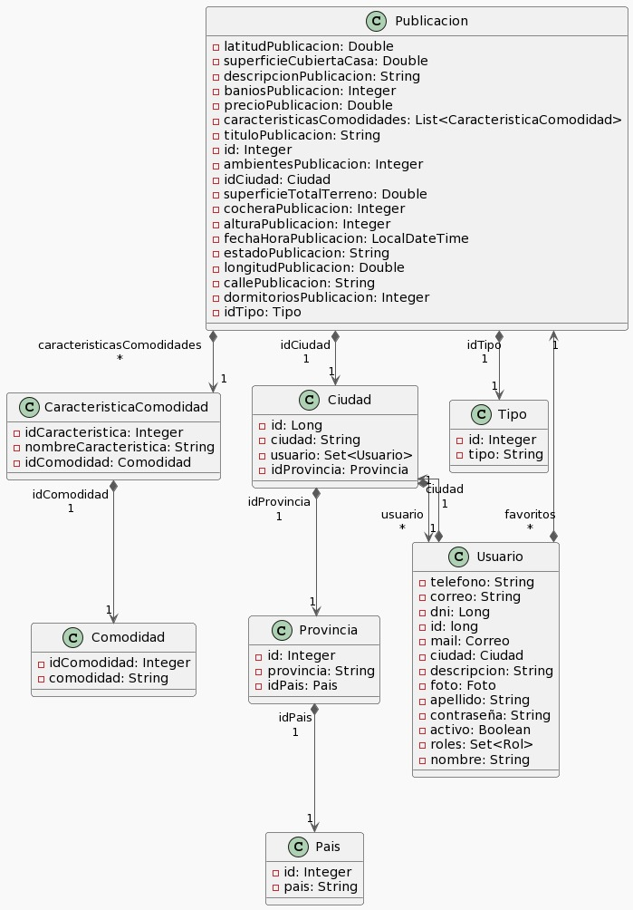
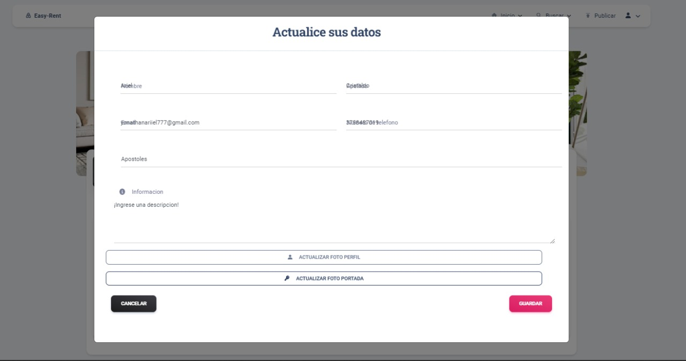
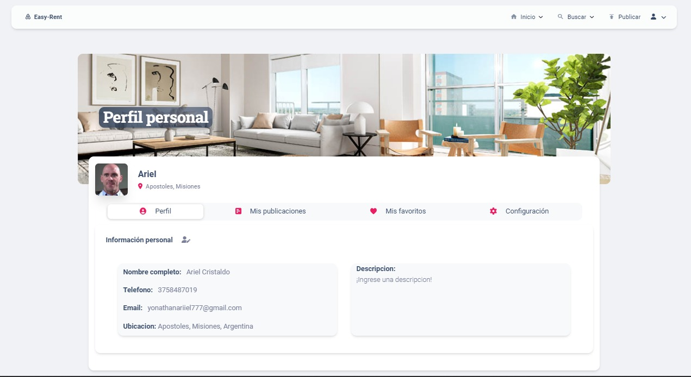
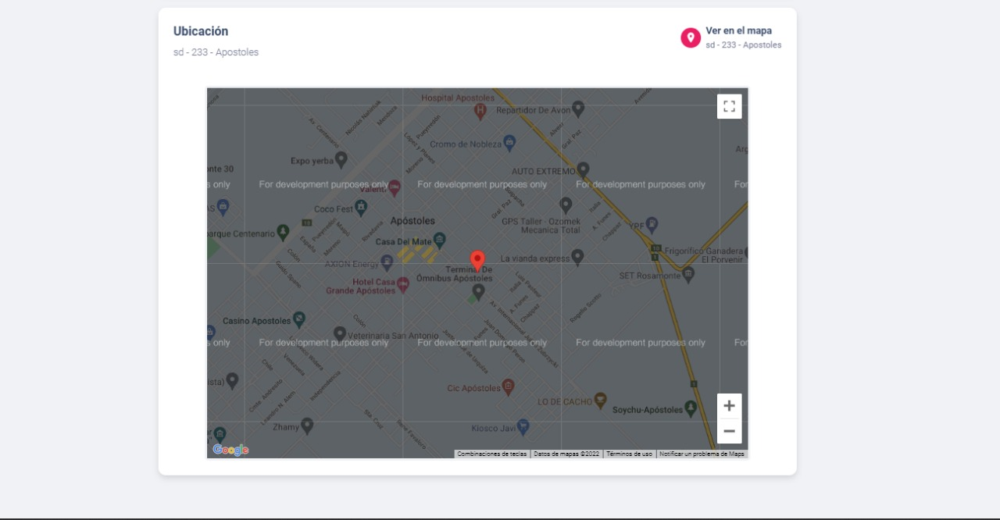

# Trabajo en equipo
El lider de la primera iteracion sera: Guillermo Quintana

La division de las Historias de Usuario sera la siguiente:
- Modificar datos de usuario
    - **Encargados**: Marcela Stigelmeier y Matias Fernandez

- Consultar usuario
    - **Encargados**: Emiliano Blazco y Ariel Cristaldo

- Consultar ubicación
    - **Encargados**: Marcela Stigelmeier, Matias Fernandez, Emiliano Blazco, Ariel Cristaldo, Guillermo Quintana, Marcelo Kachuk

# Diseño OO

# Wireframe y caso de uso

## Wireframe Modificar datos de usuario

  
**Caso de uso**:  Modificar datos de usuario  
**Descripción**:   El usuario desea modificar los datos de su cuenta  
**Precondición**:  Tener una cuenta registrada 
**Postcondición**:   --  

**Flujo Típico de eventos**:
<table>
  <tr>
    <th>Actor</th>
    <th>Sistema</th>
  </tr>
  <tr>
    <td><b>1</b>. Este caso de uso comienza cuando el usuario está  en su perfil y presiona sobre la etiqueta “Modificar datos”
    <td></td>
  </tr> 
  <tr>
    <td></td>
    <td><b>2</b>. El sistema despliega un formulario con los datos   del usuario ya cargados 
  </tr>
      <tr>
    <td><b>3</b>. El Usuario busca el dato a cambiar, lo modifica  y presiona en el botón con la etiqueta   “Guardar Modificación”
    <td></td>
  </tr> 
     <tr>
    <td></td>
    <td><b>4</b>. El sistema verifica que todos los campos se  encuentren cargados de manera correcta   y muestra el mensaje “Los datos han sido modificados correctamente”
  </tr>
</table>

<u>**Flujo Alternativo de Eventos**.</u>  

**Paso 2**: El sistema no logra cargar el formulario. Pide que cargue de nuevo el sitio 
**Paso 4**: El sistema detecta que un campo obligatorio no fue cargado. Indica cuál es el campo que no cumple con lo requerido. 
**Paso 4**:Paso 4: El sistema detecta un dato no válido, Se le informa al usuario y vuelve a ingresar la información 

## Wireframe Consultar usuario

  
**Caso de uso**: Consultar usuario  
**Descripción**: Un usuario (inquilino/propietario/administrador) desea consultar la información asociada a un perfil dentro del sistema.  
**Precondición**:  
**Postcondición**:  

**Flujo Típico de eventos**:
<table>
  <tr>
    <th>Actor</th>
    <th>Sistema</th>
  </tr>
  <tr>
    <td><b>1.</b> Este caso de uso comienza cuando  
    un usuario ingresa a una publicación  
    y hace click en el nombre del propietario.</td>
    <td></td>
  </tr>
  <tr>
    <td></td>
    <td><b>2.</b> El sistema despliega un cuadro  con toda la información pública  
    (nombre, localidad, etc) asociada 
     a ese usuario.
  </tr>
  <tr>
    <td></td>
    <td></td>
  </tr>
</table>

<u>**Flujo Alternativo de Eventos**.</u>  

**Paso 1**: El usuario hace click en el nombre de un comentario de la publicación. El sistema responde igual.  

  

## Wireframe Consultar ubicación

  
**Caso de uso**:  Consultar Ubicación 
**Descripción**:  El usuario ingresa en una publicación y se dirige a la ubicación  asociada a la propiedad pudiendo consultar cual es el lugar donde queda la propiedad mediante el uso de un mapa que indica la ubicación asociada 
**Precondición**: El usuario debe encontrarse dentro de una publicación 
**Postcondición**: --  

**Flujo Típico de eventos**:
<table>
  <tr>
    <th>Actor</th>
    <th>Sistema</th>
  </tr>
  <tr>
    <td><b>1</b>. Este caso de uso comienza cuando el usuario ingresa   en una publicación presionando sobre el nombre de  la publicación.
    <td></td>
  </tr> 
  <tr>
    <td></td>
    <td><b>2</b>. El sistema carga la información asociada a la publicación  desplegando: 
    -Imagen de la propiedad  
    -Comodidades asociadas 
    -Ubicación asociada a la propiedad 
    -Mapa con la ubicación especificada 
  </tr>
      <tr>
    <td><b>3</b>. El usuario scrollea la pantalla hasta encontrar  el apartado de Ubicación, pudiendo consultar  la ubicación donde se encuentra la propiedad y  viendo la ubicación exacta en el mapa. 
    <td></td>
  </tr> 
</table>

<u>**Flujo Alternativo de Eventos**.</u>  

**Paso 2**:El sistema no logra cargar la información asociada a la publicación. Se genera un mensaje de error y pide al usuario que se vuelva a ingresar a la publicación

  

# Backlog de iteraciones
**Iteracion 3**
- Consultar ubicación
- Modificar datos de usuario
- Consultar usuario

# Tareas

  

## **Tareas para Consultar ubicación**

**Como**  Usuario  
**Quiero**  consultar ubicación 
**Para** poder encontrar la propiedad de manera más eficiente 

<u>Criterios de aceptación</u>

-Debe mostrarse la ubicación asociada en el mapa adjunto a la publicación 
-La ubicación especificada debe coincidir con la exhibida en el mapa

<u>Las siguientes tareas comprenderán el desarrollo de la Historia de Usuario:</u>

- Creación de wireframe
    - Creación del formulario donde contendrán los siguientes elementos
        - Dentro del wireframe usado en la Historia de Usuario consultar una propiedad se incorpora un mapa el cual muestre la ubicación ingresada por el propietario
- Descripción del Uso del wireframe (Caso de Uso real)
- Creación del modelo de datos(Entidad/es de Base de datos)
- Validación de campos con sus respectivas alertas

## **Tareas para Modificar datos de usuario**

**Como**  usuario  
**Quiero**  modificar los datos de usuario 
**Para** actualizar o corregir algún dato cargado 
 

<u>Criterios de aceptación</u>

-El usuario debe tener una cuenta creada
-Los datos modificados deben ser validos 

<u>Las siguientes tareas comprenderán el desarrollo de la Historia de Usuario:</u>

- Creación de wireframe
    - Creación del formulario donde contendrán los siguientes elementos
        - (Colocar aca el desarrollo del wireframe)

- Descripción del Uso del wireframe (Caso de Uso real)
- Creación del modelo de datos(Entidad/es de Base de datos)
- Validación de campos con sus respectivas alertas

 

## **Tareas para Consultar usuario**

**Como** inquilino/propietario/administrador 
**Quiero** consultar datos de un usuario registrado  
**Para** obtener información vinculada a la persona y/o empresa.

<u>Criterios de aceptación</u>

- El sistema debe informar de la inexistencia (si así fuese) del usuario consultado.
- El inquilino/propietario debe haber ingresado al sistema.
- Solo el perfil de propietario puede ser visto de manera pública (sin haber ingresado al sistema).

<u>Las siguientes tareas comprenderán el desarrollo de la Historia de Usuario:</u>

- Creación de wireframe.
- Descripción del Uso del wireframe (Caso de Uso real).
- Controlar que se cumplieron los criterios de aceptación.

# Retrospectiva de la Iteracion 2

Teniendo en cuenta lo realizado en la release 2 podemos decir que hubo un gran aporte por parte de todos los integrantes del grupo
cada uno cumpliendo con sus tareas asignadas y trabajando de manera correcta con el repositorio de github.
Por otra parte se realizaron de manera completa las 4 actividades (Dar de baja una propiedad, Consultar propiedad(exclusivo para propietarios), Ver detalles del alquiler(exclusivo para inquilinos), Consultar alquileres obtenidos)) planteadas para la iteracion. 
Cumpliendo con su documentacion, desarrollo de wireframes e implemntacion de funcionalidades
Ademas de esto se mantuvo la forma de trabajo de a pares, siguiendo con esta metodologia para las siguientes iteraciones.